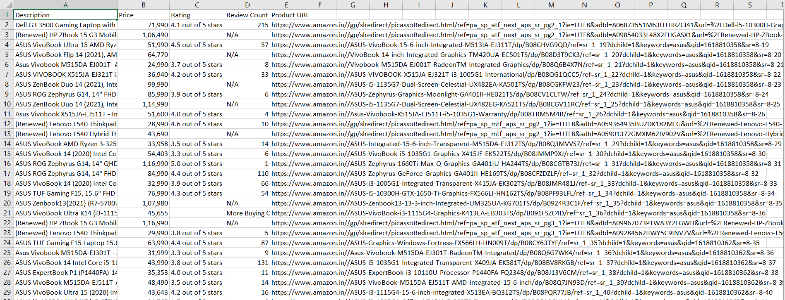

# **Amazon Product Information Scraper**

## **Libraries Used**:
* **time**
* **csv**
* **bs4**
* **selenium**
* **requests**
* **webdriver_manager**

 This script asks for a product to be searched and scrapes through all the available pages and enters the _**product name/description**_, _**price**_, _**ratings**_, _**number of reviews**_ and _**product url**_.

 A new _**CSV**_ file is created for each product. Some of the products may not have the reviews, price or number of ratings and are denoted as _**N/A**_ in the _**CSV**_ file.

Click on ***AmazonProductScraper.exe*** to run the script

**Disclaimer**: The script sometimes will show products that are not related to your search preferences because they might be sponsered posts or ads and the rating counts of all the products scraped might be **N/A**.

[**Github - Praneeth Ravuri**](https://github.com/praneethravuri)

[**Amazon Product Scraper**](https://github.com/praneethravuri/Amazon-Product-Information-Scraper/blob/main/amazon_scraper.py)

